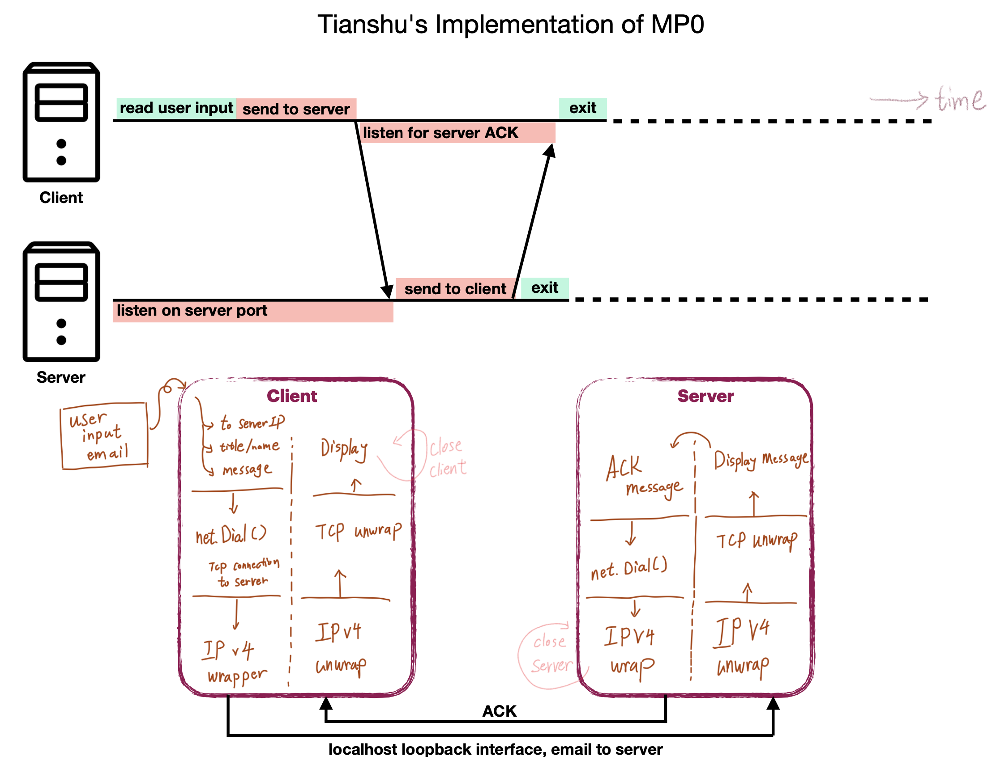
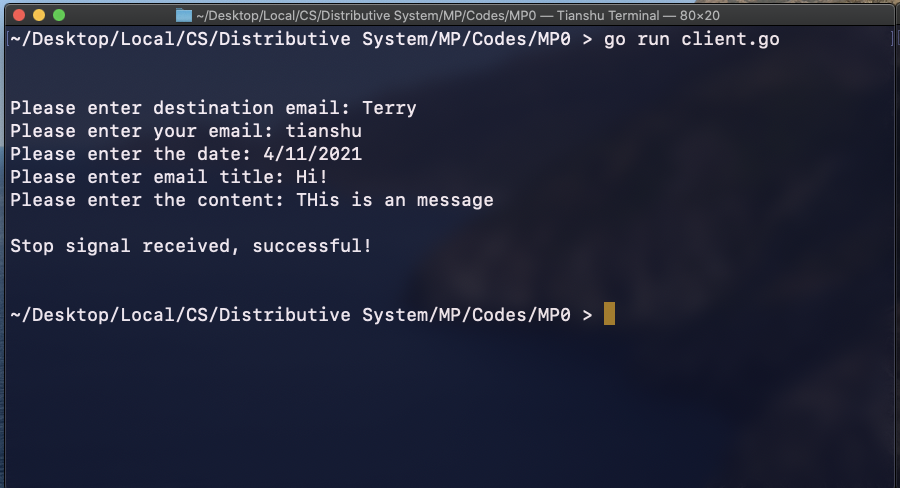
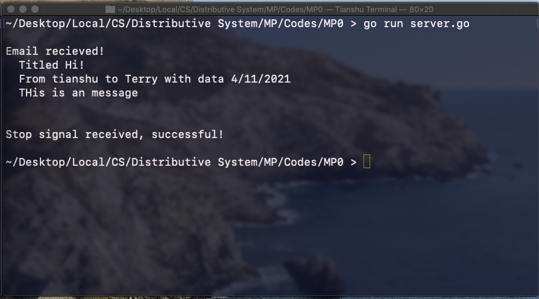

# MP0

## Established a basic TCP connection between client and server 

### 1. Inputs and Setup

* Client: client.go stores input from user into a struct called message, and forward this struct in the form of []byte to the server.go node via TCP connection
* Server: upon receiving a message from client, the server prints out an ackowledgement message and the message in a near format
* Note: only one to one connection is establsihed. The server cannot accept more than one client
* **Server.go and Client.go are meant to run in different terminals. Each as a main() function.** Do not use go build

### 2. Runing & Testing

	* To run cleint and server, use go run command in two diffferent shells and give the IP:Port that the server/client will use

``` sh
go run server.go 127.0.0.1:1234
go run client.go 127.0.0.1:1235
```


### 3. Underlying Strcutrue




### 4. Codes in Action

client.go:




server.go:




 ### 4. Credits

Using the Create a TCP and UDP Client and Server using Go article from Linode: [Source](https://www.linode.com/docs/guides/developing-udp-and-tcp-clients-and-servers-in-go/)


