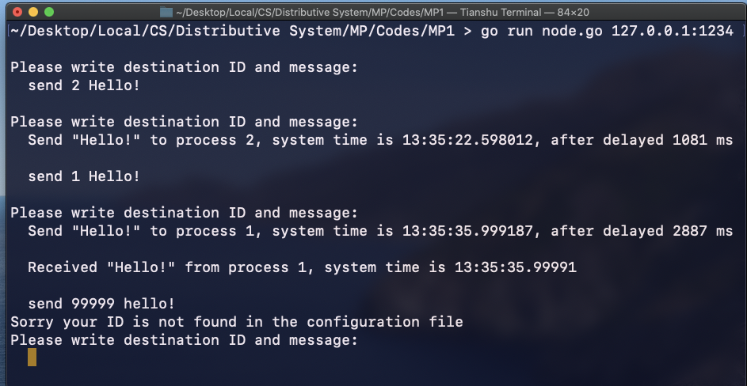
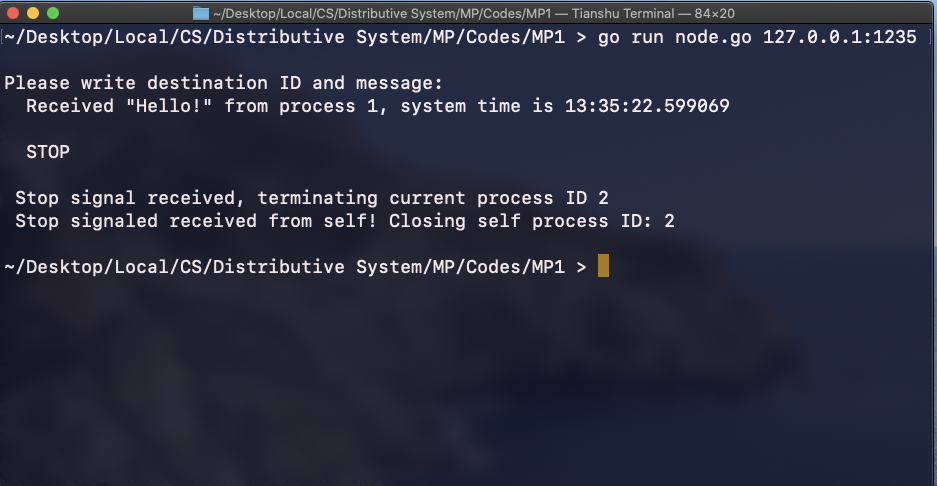

# MP1

## Established peer-to-perr TCP connection with simulated delay among many nodes according to a configuration file

### 1. Inputs and Setup

* Configuration file: first line has the min and max value of simulated delay time in milliseconds. The lines followed contian the IP:Port address paired with ID serving as a dictionary. Each node can look up this configuration file to find the IP address by ID. 

* Node: upon receiving a message from user with a destination ID, the node.go look up the ID's IP address in the configuration text file. If the ID is not found, print a warning message. If found, generate a thread to simulate the delay using time.Sleep() for a random amount of time between min and max delay time, and then send the message via TCP.

  

### 2. Runing & Testing

```tex
Change the configuration file to the desire min and max delay time as well as the IP:Port address for possible nodes
```

``` sh
go run node.go 127.0.0.1:1234
go run node.go 127.0.0.1:1235
go run node.go 127.0.0.1:1236

```

Message Format:

```tex
send ID message
   send 2 Hello!  (example)
STOP
	 (stop signal to terminate the current node)
```


### 3. Codes in Action

Node 1:




Node 2:




Code in action:


 ### 4. Credits

Using the Create a TCP and UDP Client and Server using Go article from Linode: [Source](https://www.linode.com/docs/guides/developing-udp-and-tcp-clients-and-servers-in-go/)


