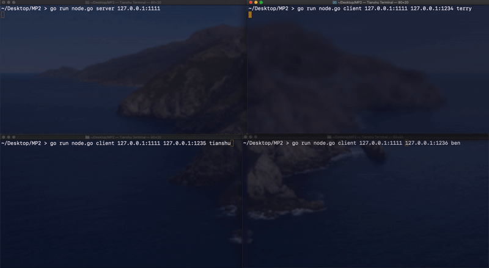

# MP2

## Simulate a server handling communication between multiple clients while keeping a DNS lookup table

### 1. Inputs and Setup

* Server: server generate a new thread whenever it receives a message from a client and forward the message to destination client. If destination is not found in server's DNS table, return a warning message. Upon shutting down, server broadcast a EXIT signal to all conencted clients

* Client: client initiate handshake with server by sending its name and IP address so server cna make a DNS entry. Upon exiting, the client send an OFFLINE message to server, so the server can remove this client's DNS entry.

    When receiving an EXIT signal from server, the client node exits. To send a message, the client can simply follow the prompt to type in username or IP address of the destination client and then type in the message. Then the message will be sent to server via TCP, and server will forward the message to destination client.

  

### 2. Runing & Testing

Server input format: ```go run server.go HostIP ```

 Client input format: ```go run client.go HostIP ClientIP username```

``` sh
go run server.go 127.0.0.1:1111
go run client.go 127.0.0.1:1234  127.0.0.1:1111  terry
go run client.go 127.0.0.1:1235  127.0.0.1:1111  tianshu
```

User Message:

```tex
send ID message
   send 2 Hello!  (example)
EXIT
	 (stop signal to terminate the current node)
```

Communication between Client and Server:

* Client -> Server
  * `ClientIP $$ username $$ INIT`   (signal server a new client tries to connect, add DNS entry)
  * `username $$ toIP/name $$ message` (send message by username to toIP/name with conetent message)
  * `username $$ OFFLINE` (signal server that client 'username' is going offline, remove DNS entry)

* Client -> Client
  * `self $$ EXIT` (signal the client receiving message thread to shut down)

* Server -> Client
  * `ServerIP $$ EXIT`   (signal client to shut down since the server is closing)
  * fromName $$ toName $$ message` (send message to the destination client)
  * `SUCCESS` (acknowledge message to client after initiation)
  * `toIP/name $$ NOT-FOUND` (warning message to client since its destination client is not found on server's DNS table) 

* Server -> Server

  * `ServerIP $$ EXIT` (signal the server receiving message thread to shut down)

    

### 3. Codes in Action

Server:


Client 1:


Client 2:


Code in action:




 ### 4. Credits

Using the Create a TCP and UDP Client and Server using Go article from Linode: [Source](https://www.linode.com/docs/guides/developing-udp-and-tcp-clients-and-servers-in-go/)


